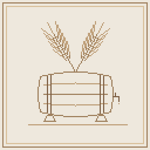

# Seed to Cellar

A farming and brewing mod for **Minecraft 26.3 (NeoForge)**. Find wild plants, grow them in many different ways, and turn
one farm into a whole web of foods and drinks: bread and stews, beer and wine, cider and mead, and whiskey, brandy, rum
and gin aging in casks in your cellar.

Everything you make can be made well. Drinks earn up to five **quality stars** from how you made them: the right yeast,
the right temperature, a day's rest or a second run through the still, and years in the right wood. The game always tells
you what you got right and what you didn't.

## Requirements

- Minecraft **26.3** with **NeoForge 26.3** (26.3.0.52-beta or later)
- Install it on **both** the client and the server. No other mods are required.
- **New worlds only.** Worlds played with the Minecraft 1.20.1 version of Seed to Cellar can't be carried over to this one.

## Installing

1. Install NeoForge for Minecraft 26.3 (from [neoforged.net](https://neoforged.net)).
2. Put `seedtocellar-26.3-1.1.0.jar` in your `mods` folder.
3. Start the game and make a new world, or open an existing 26.3 one: wild crops appear in chunks generated from now on.

## What's in it

- **The farm.** 30 crops and 8 fruit trees, each grown its own way: grain in rows, corn two blocks tall, rice in paddies,
  hops and grapes climbing trellises, berry bushes and herbs you pick again and again, agave in the desert, vanilla on
  jungle logs. Every crop likes a climate (glass overhead makes a greenhouse). Compost makes Fertile Farmland; sickles
  harvest a 3x3 and give straw; a Drying Rack dries hops, chilies, fruit and jerky.
- **The kitchen.** Flours and doughs, breads, stews and soups cooked in the Brew Kettle, jams, pickles, sauerkraut and
  kimchi in the Preserving Jar, pies and a Black Forest Cake you place and slice, and a Harvest Feast for the table.
- **The brewery.** Malt barley in the Malting Tub, roast it in the Kiln, grind it in the Millstone, mash and boil it in the
  Brew Kettle, ferment it in a Fermenting Vat. Eight beers, from pale ale to stout and lager. Wild yeast works, and
  cultured yeast works better.
- **The winery.** Stomp grapes in the Crushing Tub or crank the Fruit Press. Red, white and rosé wine, cider, perry, mead,
  ten fruit wines, sake, juices, lemonade, vinegar.
- **The distillery.** The Pot Still makes whiskey, bourbon, vodka, brandy and fruit brandies, rum, tequila, grappa and,
  through the Gin Basket, gin. Liqueurs and bitters steep in the jar.
- **The cellar.** Casks in all twelve vanilla woods age drinks a year every in-game day. Each drink has its best woods; char a
  cask for whiskey. Spirits change name and color as they age (New Make becomes Malt Whiskey, White Rum turns Gold, then
  Dark).
- **The tavern.** Bottle shelves, wine racks and displays that show your actual bottles; set drinks down on any table; bar
  counters that turn corners, bar stools you can sit on, mug racks, hop garlands, hanging bundles and a tavern sign. The
  Brew Kettle and Pot Still weather green like copper.
- **The world.** Wild crops and orchards to find; Vineyards and Brewhouses in villages, with the Vintner and Brewer to
  trade with; seeds in village chests and aged rum in shipwrecks; advancements that walk you through it all.
- **Drinking.** Each drink has a small effect (Refreshed, Warmth, Courage, or a vanilla one). Drink too fast and you get
  tipsy: the view sways (it follows vanilla's Distortion Effects slider), and too much leaves a hangover. All of it can be
  switched off.

## Finding your way

- **Tooltips:** every item says what it is and what to do next. Hold **Shift** on a drink for its quality checklist.
- **The Hydrometer** reads any station, cask or crop: progress, temperature, quality, climate.
- **JEI** shows every recipe, station and growing plant; **Jade** shows the Hydrometer's read-out as you look at things.
- **The Brewer's Almanac**, a guidebook, comes back once Patchouli is out for 26.3.

## Works with (all optional)

| Mod | What you get |
|---|---|
| JEI (and EMI through its JEI support) | Pages for every station, every plant and how to get every item |
| Jade | Live read-outs on stations, casks and crops |
| Serene Seasons | Seasons replace climates for crops, and change fermentation temperature |
| Datapacks and scripting mods | Every recipe type is plain JSON: see [docs/PACK_MAKERS.md](docs/PACK_MAKERS.md) |

The 1.20.1 version also works with The One Probe, Patchouli, Farmer's Delight, Create, Mekanism, Immersive Engineering,
Botany Pots, Tough As Nails and Cold Sweat. Each comes back here once that mod is out for Minecraft 26.3.

## Settings

`config/seedtocellar-common.toml`: crop growth speed, climate strength, Fertile Farmland, grass seed chances, every kind
of wild plant, orchard and village building, chest loot.
`config/seedtocellar-server.toml` (the server's, shared with players who join): station, fermentation and aging speeds,
drink effects, tipsiness, hangovers, hiccups, seasons' effect on temperature. For one world only, put a copy in
`saves/<world>/syncedconfig/`.
`config/seedtocellar-client.toml`: how much the view sways.

Every number a player feels is listed in [docs/BALANCE.md](docs/BALANCE.md).

## For pack makers

Recipe formats, drink data, tags and integrations: [docs/PACK_MAKERS.md](docs/PACK_MAKERS.md).

## Building it yourself

Needs JDK 25. From the project folder: `gradlew build` (the jar lands in `build/libs`), `gradlew runClient` to play in a
development game, `gradlew runGameTestServer` to run the automated tests.

## License

[MIT](LICENSE). Made by Mebb, with Claude (Anthropic). All art was made for this mod: no vanilla or third-party textures.
